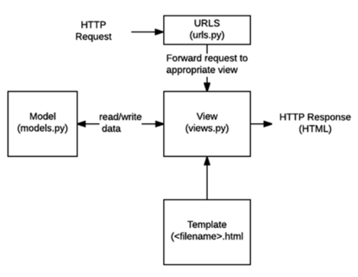
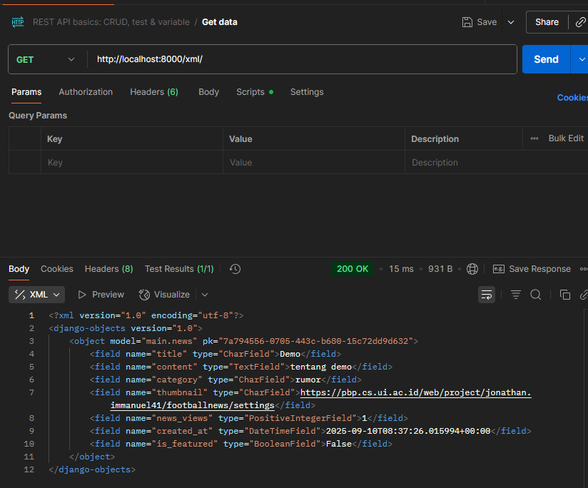
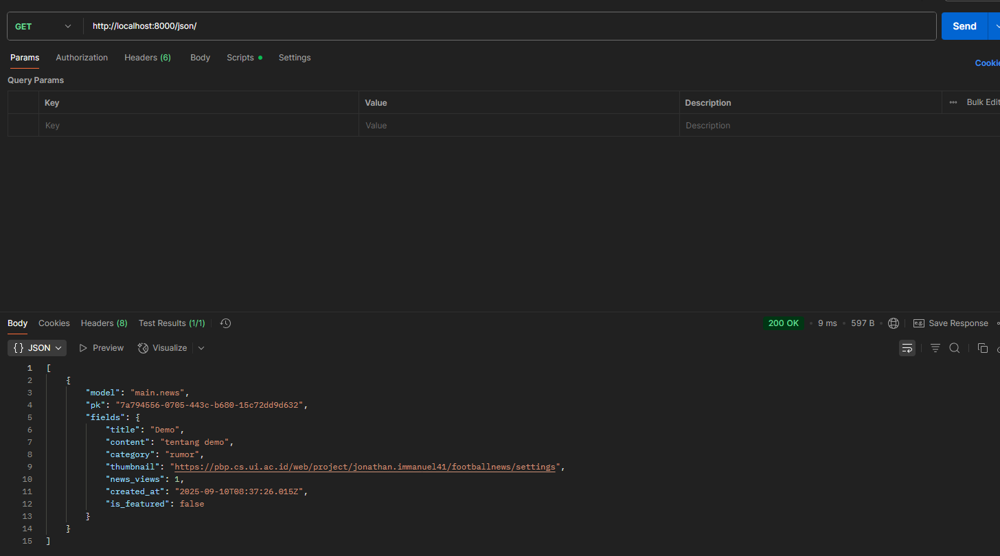
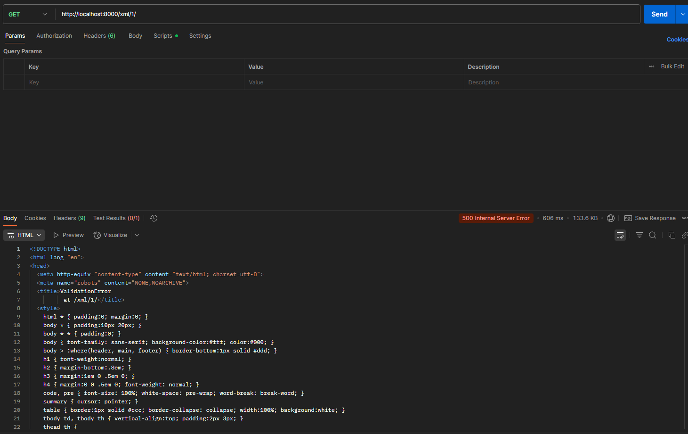
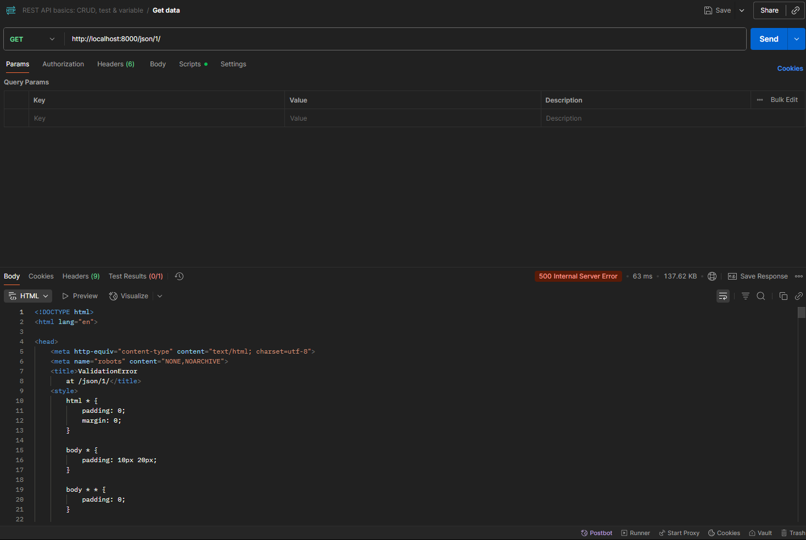

https://jonathan-immanuel41-footballshop.pbp.cs.ui.ac.id/

TUGAS INDIVIDU 2
**Jelaskan bagaimana cara kamu mengimplementasikan checklist di atas secara step-by-step (bukan hanya sekadar mengikuti tutorial).**
Dimulai dari memmbuat direktori baru yang bernama football-shop lalu buka terminal di dalam direktori tersebut. Buat virtual environment di dalam terminal yang berguna untuk mengisolasi package serta dependencies dari aplikasi agar tidak bertabrakan dengan versi lain yang ada pada laptop. Selanjutnya, buat berkas requirements.txt di dalam direktori yang sama, lalu tambahkan dan lakukan instalasi beberapa dependencies. Setelah itu, buat proyek Djanggo bernama football_shop, file .env, dan file .env.prod di direktori yang sama. Selanjutnya, buat aplikasi baru dengan nama main, di dalam main buat direktori bernama template lalu di dalamnya buat berkas bernama main.html. Isi berkas main.html dan buka di peramban web untuk ngecek tampilannya. Setelah itu, modifikasi berkas models.py di dalam direktori main sesuai dengan ketentuan yang ada di Tutorial 2 untuk mendefinisikan model baru. Selanjutnya kita akan menghubungkan view dengan template dengan cara memodifikasi berkas views.py dan template(main.html). Setelah itu, kita perlu mengonfigurasikan routing URL dengan membuat berkas urls.py di dalam direktori main lalu mengisi berkas urls.py. Modifikasi file settings.py (untuk menggunakan environment variables, menambahkan string ke ALLOWED_HOSTS, menambahkan konfigurasi PRODUCTION tepat di atas code DEBUG, dan ubah konfigurasi database, mendaftarkan 'main' di INSTALLED_APPS). 
Setelah itu migrate manage.py, lalu jalankan server Djanggo dan cek pada peramban web untuk melihat animasi roket sebagai tanda aplikasi Django berhasil dijalankan. Lalu lakukan git init, git add, git commit, dan git push ke git dan pws(agar aplikasi yang sudah dibuat dapat diakses melalui Internet)

**Buatlah bagan yang berisi request client ke web aplikasi berbasis Django beserta responnya dan jelaskan pada bagan tersebut kaitan antara urls.py, views.py, models.py, dan berkas html.**

referensi : PPT 03 - MTV Django Architecture (Slide 3)

Ketika user membuka halaman web Djanggo, browser akan mengirimkan HTTP Request. Request ini akan masuk ke urls.py yang befungsi mencari pola URL mana yang cocok dengen request tersebut. Setelah itu, request akan diteruskan ke views.py, tempat logika utama aplikasi berjalan. Di view, aplikasi kemungkinan mengambil atau menyimpan data. Oleh karena itu, view akan berkomunikasi dengan models.py yang berfungsi untuk menghubungkan ke database. Model inilah yang nantinya akan mengatur bagaimana data disimpan, diubah, dan diambil kembali. Ketika data sudah siap, view akan mengirimkannya ke template berupa file HTML. Template ini bertugas menampilkan data dengan format yang rapi dan bisa dipahami user. Hasil render dari template akan kembali ke view, lalu dikirimkan sebagai HTTP Response ke browser.

    

**Jelaskan peran settings.py dalam proyek Django!**
-> settings.py berperan sebagai pusat konfigurasi, dimana settings.py menyimpan berbagai pengaturan penting yang menentukan bagaimana aplikasi dijalankan, seperti mode debug, daftar host yang diizinkan, daftar aplikasi yang digunakan, middleware, konfigurasi database, validasi password, bahasa, zona waktu, hingga pengaturan file statis. settings.py ini diibaratkan seperti otak konfigurasi yang menghubungkan Django dengan lingkungan pengembangan maupun produksi sehingga aplikasi dapat berjalan dengan baik

**Bagaimana cara kerja migrasi database di Django?**
-> Migrasi database di Django bekerja dengan mencatat perubahan pada model ke dalam file migrasi, lalu mengeksekusinya agar struktur tabel di database selalu sinkron dengan definisi model sehingga developer tidak perlu menulis query SQL secara manual

**Menurut Anda, dari semua framework yang ada, mengapa framework Django dijadikan permulaan pembelajaran pengembangan perangkat lunak?**
-> Django dijadikan permulaan pembelajaran karena sudah menyediakan fitur lengkap sejak awal, memiliki struktur yang rapi, dokumentasi yang baik, dan mampu mengenalkan praktik software engineering dengan cara yang terarah sehingga cocok digunakan baik untuk proyek kecil maupun skala besar

**Apakah ada feedback untuk asisten dosen tutorial 1 yang telah kamu kerjakan sebelumnya?**
-> Asistensi dosen pada tutorial 1 sangat membantu dan baik, asdos membantu dan mengarahkan kita ketika terjadi error maupun ketika bertanya. Penjelasan yang diberikan asdos juga sangat jelas dan runtut dengan bahasa yang mudah dipahami

TUGAS INDIVIDU 3
# Jelaskan mengapa kita memerlukan data delivery dalam pengimplementasian sebuah platform?
Data delivery sangat penting karena seluruh proses pertukaran informasi antara server dan pengguna terjadi melalui mekanisme ini. Tanpa ini, data tidak bisa diakses atau diperbarui secara real-time sehingga aplikasi tidak dapat menampilkan informasi yang akurat. Data delivery juga memastikan integrasi antar layanan berjalan lancar, baik itu ke aplikasi mobile maupun web. Jadi, keberadaan data delivery menjadi kunci agar platform dapat berfungsi secara konsisten, aman, dan responsif.

# Menurutmu, mana yang lebih baik antara XML dan JSON? Mengapa JSON lebih populer dibandingkan XML?
Menurut saya, JSON lebih baik untuk dunia modern saat ini. JSON memiliki struktur yang lebih ringkas, mudah dibaca manusia, dan parsingnya lebih cepat dibandingkan XML. JSON juga mendukung tipe data seperti angka, boolean, array, dan objek yang lebih natural untuk dipetakan ke bahasa pemrograman yang populer saat ini. Dalam aplikasi web juga JSON jauh lebih praktis dibandingkan XML.

# Jelaskan fungsi dari method is_valid() pada form Django dan mengapa kita membutuhkan method tersebut?
Method is_valid() digunakan untuk memeriksa apakah data yang dikirim melalui form memenuhi semua aturan yang sudah didefinisikan. Dengan memanggil method is_valid(), Django akan ngecek tipe data, panjang input, dan logika lain yang kita tentukan. Jika valid, kita bisa mengambil data bersih melalui cleaned_data. Tanpa pemanggilan method ini, ada risiko data tidak valid atau berbahaya masuk ke database.

# Mengapa kita membutuhkan csrf_token saat membuat form di Django? Apa yang dapat terjadi jika kita tidak menambahkan csrf_token pada form Django? Bagaimana hal tersebut dapat dimanfaatkan oleh penyerang?
csrf_token berfungsi untuk melindungi aplikasi dari serangan Cross-Site Request Forgery (CSRF). Token ini memastikan setiap permintaan benar-benar berasal dari halaman kita, bukan dari situs lain. Jika kita tidak menambahkan csrf_token, orang yang berniat jahat bisa membuat situs palsu yang diam-diam mengirim permintaan data ke server kita dengan memanfaatkan cookie milik korban, misalnya untuk menghapus data atau mengubah password tanpa sepengetahuan pemilik akun. Dengan token ini, server dapat memverifikasi bahwa permintaan aman dan asli.

# Jelaskan bagaimana cara kamu mengimplementasikan checklist di atas secara step-by-step (bukan hanya sekadar mengikuti tutorial).
Dimulai dengan menambahkan empat fungsi views baru agar data bisa dilihat dalam format XML, JSON, juga XML dan JSON berdasarkan ID tertentu. Setelah itu saya membuat routing URL di urls.py agar setiap view tadi bisa diakses lewat alamat yang tepat. Langkah berikutnya saya membuat halaman utama yang menampilkan semua data berita dan menambahkan tombol Add untuk pindah ke halaman form, serta tombol Detail pada setiap berita agar bisa membuka halaman detailnya. Setelah halaman utama selesai, saya membuat halaman form create_news.html untuk menambahkan berita baru ke dalam database. Lalu saya menyiapkan halaman news_detail.html yang menampilkan detail lengkap dari setiap berita ketika tombol Detail diklik. Setelah semua fitur itu selesai, saya menguji satu per satu untuk memastikan semuanya berjalan lancar dan akhirnya menjawab pertanyaan yang diminta pada README di folder utama.

# Apakah ada feedback untuk asdos di tutorial 2 yang sudah kalian kerjakan?
Ya, asdos sangat responsif dan sangat baik dalam menjelaskan tutorial 2 ketika kita bertanya.

XML

JSON

XML by ID

JSON by ID

